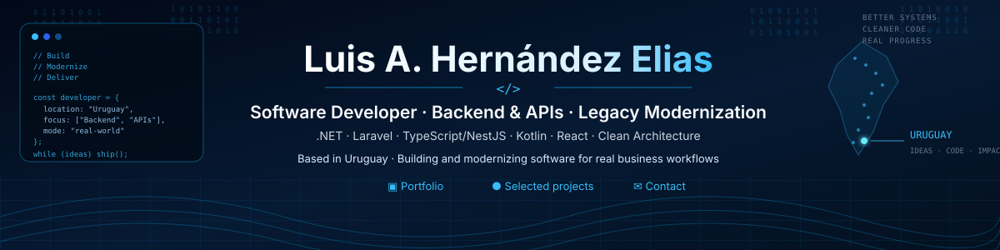

<p align="center">
  
</p>

<p align="center">
  <a href="https://eliasworks.uy/">Portfolio</a> ·
  <a href="https://eliasworks.uy/proyectos">Selected Projects</a> ·
  <a href="mailto:luisitohe@gmail.com">Contact</a>
</p>

---

## 👋 About me

I'm **Luis A. Hernández Elias**, a software developer based in Uruguay focused on **backend development, REST APIs, full-stack business applications and legacy modernization**.

I work primarily with **PHP/Laravel, C#/.NET, TypeScript/NestJS, React and PostgreSQL/MySQL**, building software from requirements and domain analysis through implementation, automated testing, CI/CD and deployment.

My current work is especially focused on systems where correctness matters: business rules, API contracts, authentication and authorization, transactional consistency, idempotency, concurrency, persistence, auditability and controlled evolution of existing applications.

I enjoy turning business requirements into software that can be **understood, tested, deployed and maintained**, not merely demonstrated.

---

## ⚡ Primary stack

<p align="center">
  
  
  
  
  
  
</p>

<p align="center">
  <strong>Backend & APIs · Full Stack · Transactional Systems · Legacy Modernization · CI/CD</strong>
</p>

---

## 🚀 Featured engineering work

### 🧾 eFactura


Brownfield modernization of an accounting, sales and electronic-invoicing platform oriented to Uruguay.

The project incrementally introduces governed Clean Architecture while preserving existing behavior and explicitly separating Domain, Application, Infrastructure and Web API responsibilities.

**Engineering focus:** versioned REST APIs, authentication and RBAC, OpenAPI, transactional boundaries, idempotency, concurrency controls, audit/outbox workflows, provider-neutral persistence, automated testing, CI/CD and controlled deployment.

➡️ [Explore eFactura](https://github.com/LuisHdezE/efactura)

---

### 🛡️ InsuranceClaims


End-to-end insurance-claims modernization case study built as a complete technical product rather than a UI prototype.

- **90 REST operations** across **76 paths** and **16 API families**
- **22 productized web surfaces**
- Clean Architecture + Ports & Adapters
- JWT + RBAC, Argon2id, idempotency and concurrency protection
- RFC 9457 Problem Details
- OpenAPI and Postman contract governance
- PostgreSQL runtime validation and browser integration journeys
- release and exact-commit CI governance

➡️ [Explore InsuranceClaims](https://github.com/LuisHdezE/InsuranceClaims)  
🌐 [View portfolio projects](https://eliasworks.uy/proyectos)

---

### 🧩 ApiBlueprint


A reusable **Laravel API designer and generator** for creating governed backend foundations according to project requirements.

Current capabilities include configurable Blank, CRUD, SaaS and Commerce templates, Clean Architecture boundaries, endpoint-level activation, exposure profiles, Sanctum/RBAC/rate-limiting choices, RFC 9457 Problem Details, correlation IDs, pagination/filtering/sorting contracts, idempotency and audit foundations, generated OpenAPI, automated tests and executable generated-solution acceptance.

➡️ [Explore ApiBlueprint](https://github.com/LuisHdezE/ApiBlueprint)

---

### 🎨 WebBlueprint


A reusable, mobile-first frontend platform for creating, demonstrating and exporting application interfaces.

It combines reusable application shells, an authenticated Composer, component gallery, navigable demos, React/Vite export, living documentation, configurable branding, responsive acceptance criteria and PR-based delivery.

🌐 [webblueprint.eliasworks.uy](https://webblueprint.eliasworks.uy/)  
➡️ [Explore WebBlueprint](https://github.com/LuisHdezE/WebBlueprint)

---

### 📱 PanicLab


Diagnostic software for analyzing iPhone panic logs and transforming raw diagnostic evidence into structured, repeatable technical analysis.

The project covers panic-log normalization, evidence extraction, deterministic diagnostic rules, panic-family classification, ranked candidates, local history, versioned Rule Packs, Android validation on physical devices and shared Kotlin Multiplatform foundations.

➡️ [Explore PanicLab](https://github.com/LuisHdezE/PanicLab)

---

## 🌐 Business applications

### 🍰 DulceHogar


Functional e-commerce and business-management platform combining a public storefront with administration for products, inventory, customers, sales, expenses, invoicing and operational reporting.

🌐 [dulcehogar.eliasworks.uy](https://dulcehogar.eliasworks.uy/)  
🔒 Private repository · public deployed application

### 🔧 MyTaller


Repair-shop management platform designed around equipment intake, customers, repair history, parts, technical operations and commercial workflows.

🔒 Private repository

### 🛒 ZoFloridane


Modernization of an existing commerce platform with emphasis on mobile purchasing, cart usability, delivery flows and safe evolution of an operational WordPress/WooCommerce system.

➡️ [Explore ZoFloridane](https://github.com/LuisHdezE/ZoFloridane)  
🌐 [zofloridane.com](https://zofloridane.com/)

---

## 🧠 Engineering approach

Alongside individual applications, I use a development workflow centered on **requirements, architecture, incremental implementation, pull requests, QA, deployment evidence and living documentation**.

```text
Understand the problem.
Define the architecture.
Build in small verifiable increments.
Keep business authority in the correct layer.
Test positive and negative paths.
Review before merge.
Deploy exact accepted commits.
Keep documentation synchronized with reality.
```

ApiBlueprint and WebBlueprint are practical extensions of that approach, turning reusable engineering decisions into executable tools.

---

## 🛠️ Technology map

### Backend & APIs


### Frontend


### Mobile


### Data


### Cloud & delivery


### Architecture & quality


---

## 🎓 Background

My professional background combines software development, information systems, technical problem solving and domain-oriented work.

I previously developed and maintained software for scientific and agricultural environments, including **PHP/Laravel APIs, institutional web applications, information systems, recommendation systems and experimental-data solutions**.

My academic background includes:

- **Master's in Knowledge Management**
- **Engineering degree**
- **Backend Web Development**
- complementary training in Java, JavaScript, data structures, Git and mobile development

---

## 📫 Contact

🌐 **Portfolio:** [eliasworks.uy](https://eliasworks.uy/)  
📧 **Email:** [luisitohe@gmail.com](mailto:luisitohe@gmail.com)  
💻 **GitHub:** [@LuisHdezE](https://github.com/LuisHdezE)  
📍 **Uruguay**

<sub>Project descriptions intentionally distinguish implemented and verified capabilities from work still in progress.</sub>
